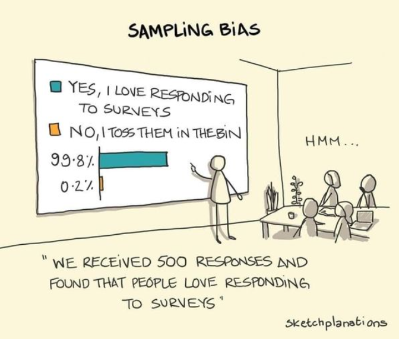

```{r setup, include=FALSE}
knitr::opts_chunk$set(echo = TRUE,
                      results='hide', 
                      cache=TRUE, 
                      warning = FALSE,
                      message = FALSE,
                      error = TRUE,
                      cache.comments = FALSE,
                      cache.lazy = FALSE)

```

```{r envir, cache=FALSE, echo = FALSE}
library(dplyr)
library(ggplot2)
library(tidybayes)
library(boot)
library(brms)
library(tidybayes)

memory.limit(size=56000)

```

\newpage

# Introduction

Causal inference is about what works, when, for whom and under what circumstances. When an event occurs -- a medical treatment, social intervention, marketing campaign, etc. -- we want to know what happened as a result, if anything. But -- and here's the crucial insight -- we also need to know what would have happened *in the absence of* the event, all else being equal. That is, the causal effect of an event is the difference between what actually happened and the counter-factual.

This working paper is a very brief practical primer on causal inference in the social, health, and business sciences. We'll use minimal formal notation and instead emphasize practical computational implementation using the `R` scripting language. It assumes a basic understanding of Bayesian regression and generalized linear modeling in `R`. Most importantly, however, it assumes an interest in the question of how we can ever know whether something caused something else and to what extent.

Without further ado, let's dive in.

# The fundamental problem of causal inference: Observed, potential and missing outcomes

We said just above that the causal effect of an event is the difference between what actually happened and the counter-factual. But here immediately the Fundamental Problem of causal inference comes crashing down at our feet: We can never observe the counter-factual!

We can never re-play history or anything of the sort. For instance, we can never give a medical treatment to a patient and also *not* give the treatment to said patient. The counter-factual outcome is often missing. Causal inference is, then, fundamentally a missing data problem.

So, the best we can do is to *infer* the counter-factual by estimation, approximation or informed (hopefully) guesswork and contrast that with the observed state. More precisely, the best we can do is to aim at an **average treatment effect** or variants thereof. An average treatment effect of, say, a medical treatment is the difference in outcomes under receiving the treatment vs. not receiving the treatment not within an individual, like the individual treatment effect, but instead *between* individuals. Further, these individuals have to be similar enough in relevant characteristics such that, whatever the difference in outcome between the treatment and no treatment groups is, in fact, explained by the treatment alone, and not by some other events or characteristics.

This, in a nutshell, is the fundamental problem of causal inference. It's simple. Deceptively so, because the real world is a mess. So we have assumptions to make. But in return we get something quite extraordinary: A rigorous, tried-and-tested workflow for thinking about cause-and-effect-relationships.

The fundamental problem of causal inference, then, is also a *promise*: A promise that, if we're careful, honest, and transparent, we might actually get causal answers to the questions that matter most in life. Or, alternatively, we'll be told that there exist no valid answers to the questions we posed. Either is a very valuable yield.

## Some notation

To make the discussion more succinct, we'll use some simple formal notation and terminology. It's useful to learn these for another reason, too: perhaps you'll want to navigate the causal inference literature on your own, when you're done here.

Throughout, $Y$ is our outcome on which our cause has or hasn't an effect, and $X$ is the cause, our predictor of interest -- say, receiving a particular medical treatment $X=1$ or not $X=0$. That is, in its simplest form, an average treatment effect is simply the difference in expected outcomes between receiving the treatment $Y^{X=1}$ or not $Y^{X=0}$. This quantity is often written as $\textrm{E}(Y^{X=1})-\textrm{E}(Y^{X=0})$, where $\textrm{E}(.)$ is the expectation operator, i.e. it computes the expected value.

## DAGs and experimental randomization

One useful tool for thinking through a causal modeling problem is **DAG**s, *directed acyclic graphs*. A DAG graphs the assumed[^1] causal relationships among variables and can thereby guide subsequent analytic strategies for recovering the causal effects of interest (or can reveal that no such effects can be recovered under any circumstances, given the DAG). *Directed* means that the relationships, denoted by arrows, are causal. *Acyclic* means that variables can't cause themselves dynamically. And *graph* means... well, that should be obvious.

[^1]: Based on prior studies, theory, commonsense, or other sources of inference.

Figure \ref{dag1} is one example of a DAG. It shows a simple but extremely common scenario in which both our cause $X$ and outcome $Y$ are influenced by a third variable $Z$. In other words, $Z$ is a **confounder**. We'll discuss confounding in more depth in sections below. For now, suffice it to say that our estimate of the cause of $X$ on $Y$ will be biased if we do not take into account $Z$. How do we know that $Z$ confounds the relationship between $X$ and $Y$ and thereby induces bias? Simple, we can read it off the DAG.

```{=tex}
\begin{figure}
    \centering
    \begin{tikzpicture}
        \node (x) at (0,1) {$X$};
        \node (z) at (1,2) {$Z$};
        \node (y) at (2,1) {$Y$};
        \path (z) edge (y);
        \path (z) edge (x);     
        \path (x) edge (y);
    \end{tikzpicture}
    \caption{\textbf{Directed acyclic graph (DAG) of confounding}.}
    \label{dag1}
\end{figure}
```

To see this, note that $Z$ has a causal effect on both $X$ and $Y$. This is technically called a **backdoor path**. A backdoor path is any set of arrows that both points into the outcome $Y$ and predictor of interest $X$. In a basic sense, causal inference is about identifying such backdoor paths and then ``blocking'' them, using study design or statistical adjustment. This simple insight makes analyzing DAGs a sort of party game or puzzle. It can actually *be fun* to draw out more or less complicated DAGs and then identify how and whether a causal effect can be recovered under this particular graph, through backdoor paths and the likes. There's more to graph analysis than looking for and blocking backdoor paths, as we'll see below. But it's a good start.

So how do we block backdoor paths? I said just above that we can, among other approaches, use particular study designs. Randomization is the best known example of such a study design. What randomization does, from the perspective of DAGs, is that it deletes any arrows that go into $X$, meaning that there can longer be any backdoor paths, by definition. Figure \ref{dag2} illustrates this. It's similar to figure \ref{dag1}, except that there's no arrow from $Z$ to $X$. Under this model, an estimate of the effect of $X$ on $Y$ is no longer biased and we don't need to measure $Z$[^2].

[^2]: Although, on a technical aside, knowing $Z$ potentially increases the precision of our estimate of $X$.

```{=tex}
\begin{figure}
    \centering
    \begin{tikzpicture}
        \node (x) at (0,1) {$X$};
        \node (z) at (1,2) {$Z$};
        \node (y) at (2,1) {$Y$};
        \path (z) edge (y);
        \path (x) edge (y);
    \end{tikzpicture}
    \caption{\textbf{DAG of randomized $X$}.}
    \label{dag2}
\end{figure}
```
Randomization allows us to delete arrows going into $X$ from all other variables because randomization is, well, random. So, whether an individual receives a randomized medical treatment will not be dependent on anything else than the randomization mechanism. In the next section, we'll show in code and simple simulated data how this works.

In sum, randomization is an efficient strategy for causal estimation, because it makes $X$ independent of all other variables in the graph. This is the reason why randomized controlled studies are often referred to as the ''gold-standard'' for causal inference. But, unfortunately, our work does not end here. Randomization is often imperfect (e.g., participants might not perfectly adhere to the randomized treatment) or not feasible for practical or ethical reasons (e.g., could we assign people to smoke in a randomized fashion such that we could estimate the causal effect of smoking on, say, cancer?).

This does not mean that all hope is lost. Causal inference in observational or pseudo-randomized contexts is possible. But it does force us to make some assumptions and add some steps to our workflow. For instance, through relatively simple statistical techniques, we can block backdoor paths that couldn't be deleted by randomization. Next section introduces the promises and pitfalls of this approach, using regression modeling.

# Blocking backdoors and the elementary ingredients of DAGs
So, how do we identify and block backdoor paths? It's actually pretty simple, at least in principle. Figure \ref{elementsdag} shows three distinct patterns that we need to be able to recognize in a DAG. We could think of these patterns as the elementary  *ingredients* of causal graphs, since any given DAG, no matter its complexity, is constructed by combining one or more of these. 

```{=tex}
\begin{figure}
    \centering
    \begin{tikzpicture}
        \node (fork) at (-4,3) {The ``Fork''};
        \node (x1) at (-5,1) {$X$};
        \node (z1) at (-4,2) {$Z$};
        \node (y1) at (-3,1) {$Y$};
        \path (z1) edge (y1);
        \path (z1) edge (x1);
        \node (fork) at (0,3) {The ``Pipe''};
        \node (x2) at (-1,1) {$X$};
        \node (z2) at (0,2) {$Z$};
        \node (y2) at (1,1) {$Y$};
        \path (z2) edge (y2);
        \path (x2) edge (z2);
        \node (fork) at (4,3) {The ``Collider''};
        \node (x3) at (5,1) {$X$};
        \node (z3) at (4,2) {$Z$};
        \node (y3) at (3,1) {$Y$};
        \path (y3) edge (z3);     
        \path (x3) edge (z3);
    \end{tikzpicture}
    \caption{\textbf{Elementary ingredients of causal graphs}.}
    \label{elementsdag}
\end{figure}
```

## The "Fork"

To see this, consider first the "fork" on the left. You'll see that it's similar to Figure \ref{dag1}, except that we've left out the arrow $X \rightarrow Y$. A fork implies that $X$ and $Y$ are only associated because of a common causal influence of $Z$. In other words, the relationshiop between $X$ and $Y$ is *confounded*. 

Given this DAG, then, we should not expect a *direct* causal influence of $X$ on $Y$; they are only associated through the confounding backdoor path $X \leftarrow Z \rightarrow Y$. By statistically adjusting for $Z$, we'd block the backdoor path, making $X$ and $Y$ independent from each other. Adjusting for $Z$ then achieves the same thing as randomization, in that it allows us to delete the arrow going into $X$ from $Z$, as we saw above. 

Let's verify this in a simple simulation.

```{r forksim}
set.seed(123)

n <- 1e4

bZ <- 0.5 

Z <- rnorm(n, 0, 1)
X <- Z*bZ + rnorm(n, 0,1)
Y <- Z*bZ + rnorm(n, 0,1)

forkdat <- data.frame(Y=Y, X=X, Z=Z)

# bX is non-zero; confounded
glm(Y ~ X, data = forkdat)

# bX is zero; de-confounded
glm(Y ~ X + Z, data = forkdat)

```

## The "Pipe"

Consider next the "pipe". As with the fork, the pipe implies that $X$ and $Y$ are only associated through $Z$. This time around, though, $Z$ is not a confounder in a traditional sense, since it's causally influenced by $X$. In other words, $Z$ is a *mediator* on the path between $X$ and $Y$. This somewhat complicates our adjustment strategy. 

If we're interested in estimating the **total effect** of $X$ on $Y$, we would not adjust for $Z$, since adjusting for $Z$ would block the part of the causal path from $X$ to $Y$ that runs through $Z$. However, say we hypothesized a **direct effect** of $X$ on $Y$ in addition to the mediating path through $Z$. If we were interested in estimating only that direct effect, we would have to adjust for $Z$, since $Z$ would otherwise confound that path. 

Again, we can verify this logic in a simple simulation.

```{r pipesim}
set.seed(123)

n <- 1e4

bX <- 0.5
bZ <- 0.5 

X <- rnorm(n, 0,1)
Z <- X*bX + rnorm(n, 0, 1)
Y <- Z*bZ + rnorm(n, 0,1)

pipedat <- data.frame(Y=Y, X=X, Z=Z)

# bX is 0.5*0.5; total effect
glm(Y ~ X, data = pipedat)

# bX is zero; direct effect
glm(Y ~ X + Z, data = pipedat)

```

## The "Collider"

With both the fork and the pipe, then, $X$ and $Y$ are associated, unless we adjust for $Z$. With our final ingredient, the "collider", it's different. Actually, it's the opposite. In a collider, $X$ and $Y$ are associated  *only if* we adjust for $Z$. That is, adjusting for $Z$ opens rather than closes a backdoor path. This is sometimes referred to as *collider bias*.

If you're like the rest of us, this is not very intuitive on a first thought, so let's check it in a simple simulation.

```{r collsim}
set.seed(123)

n <- 1e4

bX <- 0.5
bY <- 0.5 

X <- rnorm(n, 0,1)
Y <- rnorm(n, 0,1)
Z <- X*bX + Y*bY + rnorm(n, 0, 1)

colldat <- data.frame(Y=Y, X=X, Z=Z)

# bX is 0; X and Y non-associated
glm(Y ~ X, data = colldat)

# bX is non-zero; X and Y associated
glm(Y ~ X + Z, data = colldat)

```

<!-- To get a more intuitive handle on collider bias, an illustrative example might help. Consider the surprising observation that physical height does not predict success in the National Basketball Association. In the NBA, taller players are not more likely to be succesfull (i.e., in points scored) than shorter players. This seems counterintuitive; in a sports like basketball, height seems an obvious advantage, all else equal. 

But all else is not equal in collider bias land. Consider Figure \ref{collider}, which is identical to the collider graph in \ref{elementsdag} but with more informative labels.

```{=tex}
\begin{figure}
    \centering
    \begin{tikzpicture}
        \node (x) at (0,1) {Ability};
        \node[state,rectangle] (z) at (1,2) {NBA};
        \node (y) at (2,1) {Height};
        \path (x) edge (z);
        \path (y) edge (z);
    \end{tikzpicture}
    \caption{\textbf{Collider bias}.}
    \label{collider}
\end{figure}
```

In this very simplified scenario, there are two distinct ways that an individual can end up playing in the NBA: by being talented or tall. Since our analysis only focus on players within the NBA, it's as if we've adjusted for the NBA variable.

This section riffs on -- and in a few ways goes slightly beyond -- Cinelli's Crash Course [@cinelli2020crash] and McElreath 2023 Rethinking lectures 5 and 6. Many other pedagogical pieces exist, see e.g. @lubke2020we, @rohrer2018thinking, @wysocki2022statistical. -->

## Take-homes

There are many pedagogical resources that discuss in more depth the promises and pitfall of statistical adjustment for causal inference [e.g., @achen2005let; @cinelli2020crash; @lubke2020we; @rohrer2018thinking; @westreich2013table; @wysocki2022statistical]. But, for now, I focus on three critical take-home points:

### "The Table 2 fallacy"
First, we have shown how multiple regression can be an effective alternative to randomization for blocking backdoor paths. This is a wonderful promise, since it allows us to study causal relationships that would not be feasible or ethical to study in a RCT context. It also allows us to decompose effects of interest, which is particularly relevant in mediation scenarios [e.g., total vs direct effect; for a technical but accessible introduction, see @wang2015g], as well estimating an unbiased causal effect even in the presence of unmeasured confounding, using a formula known as the *front-door criterion* (**to be discussed**). 

However, when using statistical adjustment, we must tread with care. Just as statistical adjustment can block backdoor paths and thereby de-confound a true causal effect, statistical adjustment can induce bias, if we adjust for the wrong variables. We saw this in the pipe and collider examples: Adjusting for a mediator *blocks* a true causal effect, while adjusting for a collider *opens up* a non-causal path. A similar scenario, which we haven't discussed as of yet, is when a so-called *post-treatment* variable is adjusted for. Post-treatment bias can likewise mask a true causal effect (**to be discussed**).

All of this entails that we cannot in general treat all regression coefficients as "causes" of the outcome. A statistical adjustment set (e.g., whether or not to include $Z$ in a regression) is built for a particular purpose and a particular set of causal assumptions (e.g., estimating the effect of $X$ on $Y$, adjusting for assumed confounder $Z$). This in turn means that we cannot expect that the variables used for statistical adjustment also represent a particular causal effect. For all we know, parts of the adjustment set might be a collider or a mediator on some other path in the causal graph, rendering a causal interpretation invalid. 

This fundamental insight stands in contrast to common practice in many empirical sciences, where a table (often Table 2 of an empirical report) with all estimated regression coefficients is often presented -- implicitly or explicitly -- as direct causal effects. This is a very unfortunate habit as it potentially misleads the reader to interpret coefficients of the control variables causally. Accordingly, to raise awareness about the potential pitfalls of this malpractice, it has been given a name, the "Table 2 Fallacy" [@westreich2013table].

### 100,000 regressions do not make for a causal estimate
Another critical take-home is that causes are not in the data. For instance, it's not possible from the data alone to distinguish between a pipe and a fork, because they have similar statistical implications: In both cases, $X$ and $Y$ are associated, unless we condition on $Z$. But, for any given theory, whether $Z$ is thought of as a mediator or a confounder is often very different.

Therefore it follows that a DAG cannot be built on the basis of any number of regressions alone. Regressions are prediction engines, so regression coefficients only have a valid causal interpretation to the extent that identification assumptions hold. Instead, regressions can be used to *test* the implications of a particular DAG or set of DAGs [for discussion of this point in the wild, see @bendixen2023letter; @purzycki_coding_2022]. All this means that, at least in the context of an observational study where randomization was not feasible, variable selection -- which variables to include in your adjustment set -- cannot be automated; it strictly requires prior knowledge and explicit causal assumptions [@hernan2020causal; @westreich2019epidemiology].

### Average people vs. people on average: Marginal and conditional effects
The final take-home pertains to the difference between **marginal** and **conditional** estimates. Here's what I mean. 

In all but the simple cases, regression analysis yields conditional effect estimates. That is, the regression coefficient of interest is not the average effect for the whole sample but rather for a subset, conditional on the other variables in the model. To see this, consider the following simulation. 

Say we randomize some marketing campaign $X$ but suspect that age $A$ might be modifying the effect of this intervention. The DAG would then be similar to figure \ref{dag2}; since we randomized $X$, $A$ cannot be a confounder, but we're interested in modeling $A$ anyway, because it could interact with the intervention in interesting ways (e.g., younger people might be more or less willing to be persuaded by the "once-in-a-lifetime offer!!" that we're launching). For the sake of interpretation, we're modeling age in a centered and standardized manner, with a mean of 0 and a standard deviation of 1.

```{r margcon}
# inverse logit function
logistic <- function(x) exp(x)/(1+exp(x))

set.seed(123)

n <- 1e3

bX <- 1
bA <- 1
bXA <- 0.5

A <- rnorm(n, 0, 1)
X <- rbinom(n, 1, prob = 0.5)
Y <- rbinom(n, 1, prob = logistic(-0.5 + X*bX + A*bA + X*A*bXA))

model <- glm(Y ~ X * A, 
             family = "binomial", 
             data = data.frame(Y=Y, X=X, A=A))

```

Now, check the regression coefficient for $X$ in the `model` output. It's around `r round(bX,1)`. But consider now what this means. Very briefly put, in multiple regression, a coefficient represent the association of a given predictor to the outcome, when all other predictors are held at 0. The regression coefficient for $X$ represents therefore the effect of the intervention, *when age is held at 0*, that is at the average age. This is the **conditional** estimate: the intervention effect for an average-aged individual.

However, often we wouldn't be interested in this quantity, the effect of an intervention at a very particular level of a covariate (a particular year of age, in this case). Perhaps we're interested in the effect of the intervention across a range of covariate values, but the regression coefficient for $X$ is still not directly getting us there. For instance, we could get predictions for the intervention's effect for up to $\pm2$ standard deviations of the mean age like so:

```{r condpred, results='markup', dependson="margcon"}
# X=0
ndX0 <- data.frame(X=rep(0,5),
                  A=c(-2,-1,0,1,2))

estX0 <- predict(model, newdata = ndX0)

# X=1
ndX1 <- data.frame(X=rep(1,5),
                  A=c(-2,-1,0,1,2))

estX1 <- predict(model, newdata = ndX1)

# Differences
data.frame(A=c(-2,-1,0,1,2), effect=estX1 - estX0) |> 
  mutate(effect = round(effect,1)) |>
  head()

```

The resulting table is the predicted intervention `effect` across different age groups `A`, in log-odds. Note that when $A=0$, that's our regression coefficient for $X$.

This is often a good start. But imagine we want to roll out the marketing campaign at scale in a population. In that scenario, as is often the case in applied cases, we're interested in the effect of the intervention in the sample *as a whole*, averaging over the distribution of age. This is the **marginal** estimate: the intervention effect for individuals on average.

All of this is to say: there is an important distinction between making inferences for the *average* person (conditional) vs. people *on average* (marginal). 

So there we have it. Our estimand is the marginal effect, but in moderately complex cases, where we're adjusting for covariates with potentially non-linear relationships, regression only yields conditional estimates. At the same time, adjustment for covariates is often critical for de-confounding, particularly in observational settings. So, what gives? Enter g-methods.

# G-methods and marginal effects
As we saw above, multiple regression is a powerful tool for blocking backdoor paths. This allows for causal interpretation of the focal parameter(s) (but, importantly, *not* the control variables). However, regression has drawbacks that makes it insufficient for many common causal estimands, in particular when there are many covariates with complex relationships. Often, we're interested in marginal, not conditional, treatment effects -- that is, treatment effects in a population as a whole, not just subsets thereof. In more complicated data structures, such as longitudinal studies with dynamical relationships between treatment and outcome, regression alone will also fall short. In all these cases, we need a few additional tools in the trunk.

One such family of tools is known as **g-methods** -- *g* for *general* or *generalized* [@robins1986new]. Here, we'll focus on one g-method in particular, variously referred to as **g-computation** [e.g. @snowden2011implementation; @ahern2009estimating], **g-formula** and **standardization** [e.g. @vansteelandt2011invited; @hernan2020causal, ch. 13], while we'll also very briefly introduce another method, known as **inverse probability of treatment weighting** (IPTW). Standardization and IPTW rely on the same identification assumptions and will yield similar if not identical results (indeed, in many simpler cases, they are mathematically identical), but they arrive at their results at quite different analytic routes.

We focus primarily on standardization for a few reasons. First, since we want to perform our more real-world data analysis in a Bayesian framework, standardization is an obvious choice since the IPT weights are not obviously compatible with Bayes theorem [for some discussion see @robins2015bayesian; @saarela2015bayesian].

Second, compared to IPTW, standardization and its practical implementation seem to be often overlooked in popular text books and primers on causal inference and econometrics in the social and health sciences [e.g., @morgan2015counterfactuals; @pearl2016causal; @westreich2019epidemiology; @angrist2009mostly; @mcelreath_statistical_2020], although the latter stresses contrasts. It is discussed in [@hernan2020causal, ch. 13] but there's no explicit, reproducible practical/programming application, though there's a g-methods package. IPTW also does not handle interaction terms between a predictor and the outcome. 

However, given its popularity, it's useful to at least be aware of the nuts and bolts of IPTW, too. So let's briefly present the two methods in turn.

## Inverse Probability Weighting

Recall that the main aim of a covariate-adjusted analysis is to obtain conditional exchangeability: When we account for imbalances in covariates between treatment and control group, we say the two groups are exchangeable conditionally on the covariates. This means that the two groups are comparable such that if we detect a difference between the groups after the intervention, we can interpret that difference as a causal effect of the intervention. Another way to think of obtaining exchangeability is as de-confounding.

The IPTW method obtains conditional exchangeability by, in effect, creating a "pseudo-population" in which covariates are balanced between treatment and control. As the name hints at, this pseudo-population is created by estimating the probability of receiving the treatment conditional on covariates. This probability is then inverted and used as weights in a regression predicting the actual outcome of interest. 
In code, the procedure looks like this. First, we simulate a simple, confounded data structure: a binary treatment $X$ with a coefficient of $\beta x$, binary confounder $Z$ and a continuous outcome $Y$.

```{r gsim}
set.seed(123)

n <- 1e3

bX <- 0.5 

Z <- rbinom(n, 1, 0.3)
X <- rbinom(n, 1, 0.4+Z*0.5)
Y <- rnorm(n, 10 + X*0.5 + Z*0.5)

gdat <- data.frame(Y=Y, X=X, Z=Z)
```

Next, we calculate IPT weights by, first, fitting a model that regresses $X$ on $Z$. Then, for each row in the dataset, we get predictions from this model for the probability of receiving treatment. Then we compute the IPT weights and includes those weights in a regression that predicts the outcome by $X$. This latter step, the outcome regression, is known as a **marginal structural model** (MSM). It's a *marginal* model, because the coefficient of $X$ is an average (or marginal, since the estimated weights *marginalizes over* the distribution of the covariate) treatment effect in the population; and *structural*, because $X$ has a valid causal interpretation (*structural* is another word for *causal*).

```{r iptwtreat}
# inverse logit function
logistic <- function(x) exp(x)/(1+exp(x))

# receiving treatment conditional on Z
treat.mod <- glm(X ~ Z, data = gdat, family = "binomial")

# probability of treatment
gdat$pd <- predict(treat.mod) |> logistic()

# compute inverse weights
gdat$w <- with(gdat, ifelse(X==1, 1/pd, 1/(1-pd)))

# MSM of outcome
glm(Y ~ X, data = gdat, weights = w)

```

The MSM recovers the simulated coefficient for $X$ ($\beta x =$ `r bX`), even though the model does not adjust for $Z$ in a traditional sense. This is because we adjusted for $Z$ using weights. Note that this simple example could also, of course, be obtained using simple multiple regression that adjusted for $X$ and $Z$. This, however, will not be so, when we tackle more complex longitudinal data in the next section.

There are at least two ways to improve on our simple IPTW workflow above. First, above we calculated unstabilized weights, but in many cases (and always with continuous exposures), so-called **stabilized weights** are preferred (and in all cases, it's good to know about both). In brief, the stabilized weights are different from the unstabilized in that the numerator is the unconditional inverse probability of treatment and they guard against extreme weights and, in turn, variance-inflation [for more detail, see @chesnaye2022introduction]. The stabilized weights can be calculated with an intercept-only regression on treatment.

```{r iptwsw}
# intercept-only model on treatment
treat.mod.sw <- glm(X ~ 1, data = gdat, family = "binomial")

# probability of treatment
gdat$pn <- predict(treat.mod.sw) |> logistic()

# compute stabilized weights
gdat$sw <- with(gdat, ifelse(X==1, pn/pd, pn/(1-pd)))

# MSM of outcome with stabilized weight
glm(Y ~ X, data = gdat, weights = sw)

```

The other thing we can do to improve the workflow is to obtain a measure of uncertainty around our marginal estimate. However, since [**placeholder**], we can't rely on the standard error from our MSM. Instead, we must resort to **bootstrapping**, which involves running the same algorithmic routine $R$ times. This will result in a distribution of estimates with length $R$. Here's one way to implement bootstrapping with the stabilized weights.

```{r iptwboot}
# IPTW function
iptw_fun <- function(formula, data, indices) {
  d <- data[indices,] 
  fit <- glm(formula, family="gaussian", weights=sw, data=d) 
  return(coef(fit))
}

iptw.result <- boot(
                # set data
                data=gdat,
                # set function
                statistic=iptw_fun, # set function
                # set R
                R=1e4,
                # specify formula
                formula=Y ~ X)

# bootstrapped point estimate for bX
iptw.point <- iptw.result$t0[2]

# bootstrapped interval for bX 
iptw.interval <- boot.ci(iptw.result, 
                         type = "norm", 
                         index = 2)$normal

```

```{r iptwbootplot, dependson="iptwboot", echo=FALSE, fig.align = 'center', fig.width=4, fig.height=2}
theme_set(theme_gray(base_size = 10) +
            theme(panel.grid = element_blank(),
                  axis.ticks.y = element_blank(),
                  axis.text.y = element_blank()))

data.frame(ATE = iptw.result[["t"]][,2]) |>
  ggplot(aes(x = ATE)) +
  stat_halfeye(point_interval = "mean_hdci", .width = 0.9) +
  ylab(NULL) +
  labs(title = "Bootstrapped IPTW",
       subtitle = "Mean and 90% HDI in black")

```

That's it for IPTW for now. They are popular and reasonably straightforward to implement -- although practical issues remain [e.g., @austin2015moving]. For instance, what do to with extreme weights? Some suggest that extreme weights need to be truncated or trimmed at some threshold. This might work, although to me it seems somewhat unprincipled (e.g., what is an extreme weight anyway?).

In any case, as mentioned, since there's no very clear way of obtaining uncertainty in the weights and then propagate that uncertainty to the MSM in a formal Bayesian framework, we leave IPTW here.

## Standardization

Standardization is our main g-method here. It's arguably even more straightforward to implement than IPTW, as it requires us to only fit a single regression of the outcome and then do some post-fitting simulation.

The conceptual steps in standardization are as follows:

-   Fit a theoretically informed model of the outcome including the treatment, covariates and possibly non-linear relationships and functional forms (e.g., interaction terms, quadratic terms, etc.)

-   Duplicate the original data, set $X=1$ for all individuals, and then obtain predictions of the outcome using the fitted model holding covariate(s) $Z$ as observed $z$, $E[Y^{Z=z, X=1}]$.

-   Duplicate the original data, set $X=0$ for all individuals, and then obtain predictions of the outcome using the fitted model holding covariate(s) $Z$ as observed $z$, $E[Y^{Z=z, X=0}]$.

-   For each draw of the posterior distribution, compute contrast corresponding to the estimand of interest, $E[Y^{X=1}] - E[Y^{X=0}]$.

In code, using Bayesian estimation with default priors via `Stan` and `brms`, the steps are these.

```{r standmod}
# outcome model 
stand.mod <- brm(Y ~ X + Z,
                 data = gdat, 
                 family = "gaussian", 
                 cores = 4)
```

```{r standproc, dependson="standmod"}
# set X=1, Z=z
X1 <- transform(gdat, X=1)

# set X=0, Z=z
X0 <- transform(gdat, X=0)

# E[Y{Z=z, X=1}]
EX1 <- add_epred_draws(stand.mod, newdata = X1)

# E[Y{Z=z, X=0}]
EX0 <- add_epred_draws(stand.mod, newdata = X0)

# E[Y{X=1} - Y{X=0}]
ate <- data.frame(X1 = EX1$.epred,
                  X0 = EX0$.epred,
                  draw = EX0$.draw) |> 
  # for each posterior draw...
  group_by(draw) |>
  # ... calculate ATE
  summarise(ate = mean(X1 - X0))

```

The distribution of contrasts calculated in that final step are marginal estimates in that the two expectations $E[Y^{Z=z, X=1}]$ and $E[Y^{Z=z, X=0}]$ marginalize or average over the covariate(s) $Z$. We summarize the contrast by its posterior mean and 90% HPDI and plot the distribution against the bootstrapped IPTW, using the `tidybayes` package. Results are almost identical, although g-computation looks slightly more precise in this particular case.

```{r standplot, dependson=c("iptwboot","standproc"), echo=FALSE, fig.align = 'center', fig.width=4, fig.height=2}
theme_set(theme_gray(base_size = 10) +
            theme(panel.grid = element_blank()))

data.frame(ATE = c(ate$ate, iptw.result[["t"]][,2]),
           type = c(rep("G-computation", length(ate$ate)), 
                    c(rep("IPTW", length(iptw.result[["t"]][,2]))))) |>
  ggplot(aes(x = ATE, y = type)) +
  stat_halfeye(point_interval = "mean_hdci", .width = 0.9) +
  ylab(NULL) +
  labs(title = "G-computation vs. bootstrapped IPTW",
       subtitle = "Posterior means and 90% HDIs in black")

```

When performing standardization in a frequentist setting, we'd have to resort to bootstrapping in order to obtain valid uncertainty around the contrast [see e.g. @snowden2011implementation], as with IPTW. However, in a Bayesian setting, we get uncertainty in one go, since the predicted values are valid posterior distributions of expectations.

One more thing: There's a fancy `R` package called `marginaleffects` that does all of this under the hood. Here's how:

```{r marginal effects}
# marginaleffects solution
library(marginaleffects)

avg_comparisons(stand.mod, variables = "X")
```

It's certainly more compact but, for pedagogical purposes, we won't pursue this solution further here; black-boxing the computational steps might be convenient but it does very little to enhance understanding. It's useful to know about, however, if nothing else for double checking our results.

Okay, now that we have introduced g-methods in a very simple data context, we're ready to tackle more complex data structures, where regression modeling alone falls short.

## Longitudinal analysis and time-varying treatments

For illustrating a longitudinal data context with time-varying treatment, we'll simulate from the DAG in figure \ref{dag-simpleg}. Suppose that our treatment $X$ is randomized but administered according to some time-varying covariate $Z$. We're interested in the *joint effects* of the treatment $X_0$ and $X_1$ on our outcome $Y$ (that is, the effects of each treatment on the outcome not through the subsequent treatment), denoted by the dashed edges.

```{=tex}
\begin{figure}
    \centering
    \begin{tikzpicture}
        \node (z0) at (-4,0) {$Z_0$};
        \node (x0) at (-2,0) {$X_0$};
        \node (z1) at (0,0) {$Z_1$};
        \node (x1) at (2,0) {$X_1$};
        \node (y) at (4,0) {$Y$};
        \node [state,circle] (u) at (0,-2) {$U$};
    \path (x0) edge [dashed] [bend left=30] (y);
        \path (z0) edge (x0);
        \path (x0) edge (z1);
    \path (u) edge (z1);
    \path (u) edge (y);
    \path (z1) edge (x1);
    \path (x1) edge [dashed] (y);
    \end{tikzpicture}
    \caption{DAG of longitudinal treatment-confounder feedback.}
    \label{dag-simpleg}
\end{figure}
```
However, some unobserved variable $U$ affects both $Z_1$ and $Y$. This confounds the relationship between the treatment and the outcome via the backdoor path $Y \leftarrow U \rightarrow Z_1 \rightarrow X_1$. This in turn means that in order to estimate the hypothesized causal path $X_1 \rightarrow Y$, we'd want to adjust for $Z_1$.

But here's the issue: $Z_1$ is also a collider on the path $Y \leftarrow U \rightarrow Z_1 \leftarrow X_0$, implying that if we condition on $Z_1$, we open a non-causal path between $X_0$ and $Y$. All in all, under this DAG, we're not able to estimate the joint effects of $X_0$ and $X_1$ on $Y$ using a single regression model, since the two treatment indicators imply different adjustment sets. G-methods to the rescue.

First, we simulate some data, under the model presented in figure \ref{dag-simpleg}. To keep things simple, we assume that the treatment, in fact, does not have any direct impact on $Y$ (i.e., we could delete the dashed edges), such that the true coefficients of $X_0$ and $X_1$ should be (roughly) zero.

```{r longsimplegdat}
set.seed(1)

n <- 2e4

U <- rnorm(n, 0, 1)
Z_0 <- rbinom(n, 1, 1/(1+exp(0.5)))
X_0 <- rbinom(n, 1, 1/(1+exp(0.5 + Z_0*0.5)))
Z_1 <- rbinom(n, 1, 1/(1+exp(0.5 + X_0*0.5+U*0.5)))
X_1 <- rbinom(n, 1, 1/(1+exp(0.5 + Z_1*0.5)))

Y <- rnorm(n, 10 + U*2)

lgdat <- data.frame(Y=Y, X_0=X_0, X_1=X_1, Z_0=Z_0, Z_1=Z_1, U=U)
```

Then, we verify the havoc that $Z_1$ can wreak, if we haphazardly estimated the effect of $X_0$ on while adjusting for $Z_1$. The coefficient is solidly non-zero.

```{r longnaivex0, dependson="longsimplegdat"}
mx0 <- glm(Y ~ X_0 + Z_1, data = lgdat)
summary(mx0)
confint(mx0)
```

And similarly, we check that *not* adjusting for $Z_1$ can bias our estimate of $X_1$.

```{r longnaivex1, dependson="longsimplegdat"}
mx1 <- glm(Y ~ X_1, data = lgdat)
summary(mx1)
confint(mx1)
```

Then, we apply standardization to the data. The logic is the same as discussed above, only now we have two time points.

So, we first fit a model for the treatment at time point 0 and then compute the contrast in expectations between receiving and not receiving the treatment, $E[Y^{X_0=1, Z_0=z_0}] - E[Y^{X_0=0, Z_0=z_0}]$. Next, we fit a model for receiving treatment at time point 1 and similarly compute the contrast in expectations between receiving and not receiving the treatment, $E[Y^{X_1 = 1, X_0=x_0, Z_1=z_1}] - E[Y^{X_1=0, X_0=x_0, Z_1=z_1}]$.

```{r longstandt0, dependson="longsimplegdat"}
# Outcome model for X_0
yX0model <- brm(Y ~ X_0 + Z_0, 
                data = lgdat, 
                cores = 4)
```

```{r longstandt0proc, dependson=c("longstandt0", "longsimplegdat")}
# E[Y{X_0=1, Z_0=z_0}]
EX01 <- add_epred_draws(yX0model, newdata = transform(lgdat, X_0=1))

# E[Y{X_0=0, Z_0=z_0}]
EX00 <- add_epred_draws(yX0model, newdata = transform(lgdat, X_0=0))

# E[Y{X=1} - Y{X=0}]
ateX_0 <- data.frame(X_01 = EX01$.epred,
                     X_00 = EX00$.epred,
                     draw = EX00$.draw) |> 
  # for each posterior draw...
  group_by(draw) |>
  # ... calculate ATE
  summarise(ate = mean(X_01 - X_00))

```

```{r longstandt1, dependson=c("longstand", "longsimplegdat")}
# Outcome model for X_1
yX1model <- brm(Y ~ X_0 + X_1 + Z_1, 
                data = lgdat, cores = 4)
```

```{r longstandt1proc, dependson=c("longstandt1", "longsimplegdat")}
# E[Y{X_0=1, Z_0=z_0}]
EX11 <- add_epred_draws(yX1model, newdata = transform(lgdat, X_1=1))

# E[Y{X_0=0, Z_0=z_0}]
EX10 <- add_epred_draws(yX1model, newdata = transform(lgdat, X_1=0))

# E[Y{X=1} - Y{X=0}]
ateX_1 <- data.frame(X_11 = EX11$.epred,
                     X_10 = EX10$.epred,
                     draw = EX10$.draw) |> 
  # for each posterior draw...
  group_by(draw) |>
  # ... calculate ATE
  summarise(ate = mean(X_11 - X_10))
```

By breaking the procedure down into separate models -- one for each time point and treatment -- we by-pass the problem that a single regression runs into, namely that $Z_1$ is both a collider and a confounder. The resulting contrasts, stored in `ateX_0` and `ateX_1` and plotted below, are valid causal estimates of the joint effects of each treatment on the outcome (to the extent that the identification assumptions hold (we discuss these assumptions in the next section). 

Recall that we simulated the joint effects as non-existing, so the contrasts should be around zero. They are not *exactly* centered on 0 due to sampling variability; we're only showing a single run of simulation and analysis here.


```{r longstandplot, dependson=c("longstandt0proc","longstandt1proc"), echo=FALSE, fig.align = 'center', fig.width=4, fig.height=2}
theme_set(theme_gray(base_size = 10) +
            theme(panel.grid = element_blank()))

data.frame(ATE = c(ateX_0$ate, ateX_1$ate),
           type = c(rep("X_0", length(ateX_0$ate)),
                    rep("X_1", length(ateX_1$ate)))) |>
  ggplot(aes(x = ATE, y = type)) +
  stat_halfeye(point_interval = "mean_hdci", .width = 0.9) +
  ylab(NULL) +
  xlim(c(-0.3,0.3)) +
  labs(title = "Joint effects of X_0 and  X_1 on Y",
       subtitle = "Posterior means and 90% HDIs in black")

```

Now for the finale. The DAG in Figure \ref{dag-simpleg} comes from @hernan2020causal, and it's useful in that it illustrates how regression modeling alone breaks if our estimands require different adjustment sets -- for instance, if a variable is both a confounder that we want to adjust for and a collider that we want to keep unadjusted.

But let's take standardization for a spin in a real-world data analysis example. @vanderweele2016causal sets the stage for our example: religion and (mental) health.

The DAG could look something like figure \ref{dagvelux}.

```{=tex}
\begin{figure}
    \centering
    \begin{tikzpicture}
        \node (x1) at (-1,0) {$R_1$};
        \node (x2) at (1,0) {$R_2$};
        \node (x3) at (3,0) {$R_3$};
        \node (x4) at (5,0) {$R_4$};
        \node (z1) at (-1,2) {$H_1$};
        \node (z2) at (1,2) {$H_2$};
        \node (z3) at (3,2) {$H_3$};
        \node (z4) at (5,2) {$H_4$};
        \node (c) at (-3,1) {$C$};
        \path (x1) edge (x2);
        \path (z1) edge (z2);
        \path (x1) edge (z2);
        \path (x1) edge (z3);
        \path (x1) edge (z4);
        \path (z1) edge (x3);
        \path (z1) edge (x4);
        \path (z1) edge (x2);
        \path (x2) edge (z3);
        \path (z2) edge (x3);
        \path (x2) edge (x3);
        \path (z2) edge (z3);
        \path (x2) edge (z4);
        \path (z2) edge (x4);       
        \path (x3) edge (x4);
        \path (z3) edge (z4);
        \path (x3) edge (z4);
        \path (z3) edge (x4);
        \path (c) edge (-2,0.5);
        \path (c) edge (-2,1);
        \path (c) edge (-2,1.5);
    \end{tikzpicture}
    \caption{DAG of longitudinal exposure-outcome feedback.}
    \label{dagvelux}
\end{figure}
```
$C$ is a set of baseline covariates comprising standard demographics, including age, gender, income and education; the indefinite arrows indicate confounding on all observed variables). Our exposure $R_{1-4}$ represent level of religiosity ("How important is religion to you?", measured on a 1 ("not at all important") to 4 ("very important") scale.) measured at four time points, and $H_{1-4}$ are subjective general health ("How would you describe your current health?", measured on a 1 ("very bad") to 5 ("very good") scale.), a set of time-varying covariates. Note the complex causal relationships across time between $R$ and $H$.

To provide some background, this dataset comes from a panel study on a pseudo-representative sample of Danes during the COVID-19 pandemic [for more detail, see @mauritsen_bendixen_christensen_2022]. As investigators, we are interested in assessing whether religiosity was a protective factor in terms of subjective general well-being in the context of the stress and uncertainty of a pandemic. If that was so, we'd expect a positive effect of religiosity on subjective health.

Suppose, then, that our estimand of interest is the contrast in subjective well-being at the final measurement time (that is, $Y=H_4$) between being "maximally religious" $Y^{R_1=R_2=R_3=4}$ and being "minimally religious" $Y^{R_1=R_2=R_3=1}$. That is, we're interested in the *joint effects* of being religious on health at all time points up to the final measurement, meaning partitioning the respective effects of religiosity level at each time point on the outcome, *except those running through the subsequent measurements of religiosity*.

Note that we could've made the causal diagram even more involved by hypothesizing that our two time-varying variables also caused future versions of themselves beyond the immediately subsequent time point (e.g., adding paths $R_1 \rightarrow R_3$, $R_1 \rightarrow R_4$, $H_1 \rightarrow H_3$, $H_1 \rightarrow H_4$, etc.).

However, even as it stands, this analysis is not straightforward. Consider for instance that some of the effect of $R_1$ on the outcome works through $H_2$ (and $H_3$) and that if we adjust for $H_2$ (or $H_3$), we'll block some of the effect of $R_1$. But note too that $H_2$ (through $H_3$) confounds the relationship between $R_3$ and the outcome, such that if we do not adjust for $H_2$ (or $H_3$), the estimate for the effect of $R_3$ will be biased.

All this implies that $H_2$ is *both* a mediator that we'd want to keep unadjusted *and* a confounder that we'd want to adjust for. A single regression cannot handle this situation. But, as we've already seen, g-methods can.

First, we load the data and packages and set the number of iterations to use in sampling. For now, we use only the complete cases (in all variables but for $R_4$, which we're not actually using at this moment); below, we'll discuss in more detail what a complete cases analysis implies and ways of handling missing covariate values when using standardisation.

```{r veluxprep}
veluxData <- read.csv("velux_data.csv")

veluxData <- with(veluxData, 
          data.frame(
            id,
            R1 = religion_1,
            R2 = religion_2,
            R3 = religion_3,
            H1 = health_1,
            H2 = health_2,
            H3 = health_3,
            H4 = health_4,
            G = gender,
            A = age.c,
            E = education,
            I = household_income)
)

d <- veluxData[complete.cases(veluxData[, !names(veluxData) %in% c("R4")]),]

iter <- 2000

```

Then, we fit the model for $R_1$ on the outcome $H_4$. We're interested in estimating all paths from $R_1 \rightarrow H_4$ except those through subsequent religiosity measurements, while controlling for the demographic confounders. This means that, in addition to the baseline covariates and our main exposure $R_1$, we only need to include $R_2$ in the model. Adjusting for $R_2$ blocks the paths from $R_1$ to the outcome through subsequent measures of religion. Had we assumed the path $R_1 \rightarrow R_3$, we'd have to include $R_3$, too, to block the path $R_1 \rightarrow R_3 \rightarrow H_4$.

```{r veluxr1, dependson="veluxprep"}
## Outcome model for religion_t1
r1mod <- brm(H4 ~ G + A + E + I + R1 + R2,
             data = d,
             cores = 4, 
             iter = iter, 
             control = list(adapt_delta = 0.99))

# Min. religious: E[Y{R_1=1, C=c, R_2=r_2}]
ER10 <- add_epred_draws(r1mod, newdata = transform(d, R1=1))

# Max. religious: E[Y{R_1=4, C=c, R_2=r_2}]
ER11 <- add_epred_draws(r1mod, newdata = transform(d, R1=4))

# Contrast: E[Y{R_1=4}] - E[Y{R_1=1}] 
ateR1 <- data.frame(ER10 = ER10$.epred,
                    ER11 = ER11$.epred,
                    draw = ER11$.draw) |> 
  # for each posterior draw...
  group_by(draw) |>
  # ... calculate ATE
  summarise(ate = mean(ER11 - ER10))

# compare with marginaleffects
median_qi(ateR1$ate)
marginaleffects::avg_comparisons(r1mod, 
                                 variables = list(R1 = "minmax"))

```

Next, we fit a model for $R_2$. In addition to the main exposure and the demographic covariates, we need to adjust for both $R_1$ (because it's a confounder on the path $R_2 \leftarrow R_1 \rightarrow Z_4$), $R_3$ (to block the path $R_2 \rightarrow R_3 \rightarrow Z_4$) and $Z_1$ (because it's a confounder on the path $R_2 \leftarrow Z_1 \rightarrow Z_2 \rightarrow Z_3 \rightarrow Z_4$).

```{r veluxr2, dependson="veluxprep"}
## Outcome model for religion_t2
r2mod <- brm(H4 ~ G + A + E + I + R1 + R2 + R3 + H1,
             data = d,
             cores = 4, 
             iter = iter, 
             control = list(adapt_delta = 0.99))

# Min. religious: E[Y{R_1=1, C=c, R_2=r_2, R_3=r_3, H_1=h_1}]
ER20 <- add_epred_draws(r2mod, newdata = transform(d, R2=1))

# Max. religious: E[Y{R_1=4, C=c, R_2=r_2, R_3=r_3, H_1=h_1}]
ER21 <- add_epred_draws(r2mod, newdata = transform(d, R2=4))

# Contrast: E[Y{R_1=4}] - E[Y{R_1=1}] 
ateR2 <- data.frame(ER20 = ER20$.epred,
                    ER21 = ER21$.epred,
                    draw = ER21$.draw) |> 
  # for each posterior draw...
  group_by(draw) |>
  # ... calculate ATE
  summarise(ate = mean(ER21 - ER20))

# compare with marginaleffects
median_qi(ateR2$ate)
marginaleffects::avg_comparisons(r2mod, 
                                 variables = list(R2 = "minmax"))

```

Finally, the model for $R_3$ adjusts for the demographic covariates as well as $R_2$ (because it's a confounder on the path $R_3 \leftarrow R_2 \rightarrow Z_4$) and $Z_2$ (because it's a confounder on the path $R_3 \leftarrow Z_2 \rightarrow Z_4$ through $Z_3$). Notice that, had we assumed a causal relationship $R_4 \rightarrow Z_4$, $R_4$ would have to be included, too.

```{r veluxr3, dependson="veluxprep"}
# Outcome model for religion_t3
r3mod <- brm(H4 ~ G + A + E + I + R2 + R3 + H2,
               data = d,
               cores = 4, 
               iter = iter, 
               control = list(adapt_delta = 0.99))

# Min. religious: E[Y{R_1=1, C=c, R_2=r_2, R_3=r_3, H_2=h_2}]
ER30 <- add_epred_draws(r3mod, newdata = transform(d, R3=1))

# Max. religious: E[Y{R_1=4, C=c, R_2=r_2, R_3=r_3, H_2=h_2}]
ER31 <- add_epred_draws(r3mod, newdata = transform(d, R3=4))

# Contrast: E[Y{R_3=4}] - E[Y{R_3=1}] 
ateR3 <- data.frame(ER30 = ER30$.epred,
                    ER31 = ER31$.epred,
                    draw = ER30$.draw) |> 
  # for each posterior draw...
  group_by(draw) |>
  # ... calculate ATE
  summarise(ate = mean(ER31 - ER30))

# compare with marginaleffects
median_qi(ateR3$ate)
marginaleffects::avg_comparisons(r3mod, 
                                 variables = list(R3 = "minmax"))

```

The objects `ateR1`, `ateR2` and `ateR3` store the posterior means and HPDIs of the joint effects of religiosity on subjective health. Inspect the plot below to see that the contrasts huddle mostly around zero, meaning that we find little evidence for the notion that religion on average works as a protective factor during the pandemic: At least in these (self-reported) data, more religious individuals were not more healthy. If anything, these data point to the opposite relationship, in that most of the joint posterior mass is negative. 

```{r veluxstandplot, dependson="veluxprep", echo=FALSE, fig.align = 'center', fig.width=4, fig.height=2}
theme_set(theme_gray(base_size = 10) +
            theme(panel.grid = element_blank()))

data.frame(ATE = c(ateR1$ate, ateR2$ate, ateR3$ate),
           type = c(rep("R1 -> H4", length(ateR1$ate)),
                    rep("R2 -> H4", length(ateR2$ate)),
                    rep("R3 -> H4", length(ateR3$ate)))) |>
  ggplot(aes(x = ATE, y = type)) +
  stat_halfeye(point_interval = "mean_hdci", .width = 0.9) +
  ylab(NULL) +
  xlim(c(-1,1)) +
  labs(title = "Joint effects of religiosity on health",
       subtitle = "Posterior means and 90% HDIs in black")

```

One last comment, before we move on: In our estimation above, we silently cut some corners, for the sake of illustrating the basic principles of standardisation in a context with time-varying confounders. There are some additional modeling complexities that we could (and perhaps should) incorporate: Monotonicity in predictors; ordinal (not gaussian) outcome; random intercepts for individuals; Bayesian imputation; non-default priors.

In the next section, we discuss assumptions that are required for a causal interpretation of estimates obtained via standardization and IPTW.

## It's assumptions all the way down

Causal inference in an observational setting generally requires several key conditions for a causal interpretation of the main exposure [e.g. @hernan2020causal, ch. 13; @naimi2017introduction]. One way to think of this exercise is that when assumptions are (assumed) satisfied, an observational study will have emulated a randomized study.

First, we assume that the potential outcomes under varying levels of exposure are independent from the observed outcomes (*conditional exchangeability*). In a perfectly randomized trial, this is the case since randomization ensures that the probability of treatment is independent of the outcome --- we say that the treatment and control groups are "exchangeable". However, in an observational setting, there can be countless factors that both influence exposure levels and the outcome. It's a main goal of a statistical model to adjust for these confounding factors, in order to obtain conditional exchangeability. For instance, as we've seen, a DAG is useful for guiding statistical adjustment. In essence, we aim to statistically block all backdoor paths that both influence our exposure M and outcome Y of interest.

Second, and relatedly, we assume *no model misspecification*, which entails that our model is specified correctly (e.g., in terms of functional relationships, no omitted confounding variables, etc.). However, whether any given statistical model and adjustment sets are sufficient to ensure these conditions hold is generally not empirically testable.

Third, and similarly, we assume that our variables are *measured without error*, another difficult-to-verify assumption, unless there are known sources of measurement error.

Fourth, we assume that an individual's observed outcome under a given exposure is equivalent to the potential outcome that would've been observed under that exposure (*counterfactual consistency*). In other words, in the context of our g-computation procedure, when we obtain expected values for participants setting $X = x$, we assume that we obtain the values that we in fact would've observed, if those participants had been observed under $X = x$.

Fifth, we assume *positivity*, which implies that individuals have similar exposure levels within all confounder levels. While this is empirically unlikely to hold in particular (for instance, when we have several covariates, including continuous ones, several groups, etc.), lack of positivity can be ignored to the extent that we're willing to assume that estimates for the strata with zero observations can be extrapolated from the model fitted on the observed strata [@hernan2020causal, p. 162].

Sixth, and more trivially, we assume temporal ordering of relevant variables, for instance such that exposures and mediating variables occur before an outcome.

# Missing data
Causal inference is fundamentally a missing data problem. All real-world analyses are marred by missingness one way or the other. In the most basic sense, this directly relates to what we above called the fundamental problem of causal inference: We're always missing the counter-factual, so we impute it through assumption-laden estimation or by finding an appropriate comparison group.

But even setting this issue aside, and even if any particular dataset is "complete," that dataset will almost always only represent a sample from a bigger population. Often, it's the population, not the sample, that we're interested in making inferences about. So in that light, we are missing data on most of the population of interest. 

Add to this the very plausible scenarios that our sample might not be a random subset of the population, that some of our variables are measured with error, or that our statistical models fail to capture key aspects of the data-generating process. These a tough but inevitable considerations. But all hope is not lost.

A comprehensive overview of data analysis in the presence of missing data is obviously outside the scope of this brief primer. Instead, I want to give a compact run down of ways to think about missing data and some practical pointers to handling it.

As touched upon just above, we'll distinguish between missingness relating to **internal** validity (i.e., is our treatment effect estimate unbiased in the sample?) and **external** validity (i.e., is our treatment effect estimate unbiased in the target population?) [@lesko2017generalizing]. 

## External validity: Sampling selection bias
Once again, DAGs can help structure our thinking. Say we're interested in estimating the effect of a health intervention on some outcome (Figure \ref{extdag}). Consider too that, even if we randomize the treatment assignment -- i.e., there's no arrows pointing into "Treatment" -- our sample might not reflect the target population that we're ultimately interested in. When it comes to external validity, we're interested in not only backdoor paths between the treatment and the outcome but also between the outcome and the sampling indicator ("Sampled" in Figure \ref{extdag}). Here, there is such a path, through "Health seeking". That is, if you're on the lookout for treatment of some ailment, you're probably more likely to both enroll in a health study and also have health conditions that are different from non-health seeking individuals [@westreich2019epidemiology, p. 208-209].

We box the "Sampled" node to emphasize that we've conditioned on the sampled individuals. This is similar to how we condition on variables by statistical adjustment, only here the conditioning happens at the design or sampling stage. 

```{=tex}
\begin{figure}
    \centering
    \begin{tikzpicture}
        \node (x) at (-2,1) {Treatment};
        \node (z) at (0,2) {Health seeking};
        \node (y) at (2,1) {Outcome};
        \node [state,rectangle] (s) at (-3,2) {Sampled $= 1$};
        \path (z) edge (y);
        \path (x) edge (y);
        \path (z) edge (s);
    \end{tikzpicture}
    \caption{\textbf{Sampling selection bias}. There's an open backdoor from the outcome to the sampling indicator.}
    \label{extdag}
\end{figure}
```

But it's not only in the health sciences that such causal structures tend to crop up. Consider, say, survey studies in general [@schuessler_selb_2019]. On the most basic level, if you plan to run a survey study, you shouldn't expect to hear from people who really don't want to participate in survey studies.

{#id .class width=40% height=40%}

Once you're habituated to thinking about external validity -- or "sampling selection bias", to use another fancy term -- this way, you'll see it everywhere. To give just one example, a recent survey study aimed at estimating how widespread spiritual needs are in the general Danish population [@stripp2023spiritual]. This was an impressive data collection effort in that they drew a random population-based sample of over 100,000 adult Danes, which was then linked up with national register-based data. This representative sample of Danes then received an invitation to participate in a survey. According to the invitation, the survey would include questions about existential and spiritual matters, such as "satisfaction with life", "meaning" and "faith". One in four responded.

Setting aside important definitional quibbles about "spirituality," here's the catch: What if people's spiritual-mindedness influences the likelihood that they respond to a survey on spirituality [@mauritsenbendixenspirituality]? Then we have a scenario as in Figure \ref{spiritdag}, where people self-select into the study based on their (non-)spiritual inclinations. This in turn means that we're sampling based on the outcome of interest and that the sample therefore no longer is representative of the target population.

```{=tex}
\begin{figure}
    \centering
    \begin{tikzpicture}
        \node (x) at (-2,1) {Demography};
        \node (z) at (0,2) {Spirituality};
        \node (y) at (2,1) {Spiritual needs};
        \node [state,rectangle] (s) at (-3,2) {Sampled $= 1$};
        \path (z) edge (y);
        \path (x) edge (z);
        \path (x) edge (y);
        \path (z) edge (s);
    \end{tikzpicture}
    \caption{\textbf{"Spiritual needs are common among Danes, who respond to surveys on spiritual needs"}. Sampling selection bias in the wild.}
    \label{spiritdag}
\end{figure}
```

This is unfortunate but there are actually ways 

### Generalizability, Transportability, Poststratification

## Bayesian imputation: Missing (completely) at random

## Missing not at random


\newpage

# To do:

- Plot results in a simple style

-   double check notation throughout -- within-document consistency and external consistency with e.g., What if? book

-   a little bit more formal detail on the IPTW weights and the difference btw. unstabilized and stabilized weigths and why we can't rely on the standard errors (and therefore must resort to bootstrapping)

- doubly robust estimators

-   Missing data MCAR, MAR, MNAR. See Morris et al. (2022, appendix) for discussion of missingness in X and/or Y in the context of g-comp.

Above, we conducted a complete cases analysis, under the assumption that missingness is unsystematic. One way to investigate this assumption a little bit further is to ask, *does health predict dropout at the final measurement*? This is not a bulletproof "test" by any means, but it's a start.

```{r miss}
veluxData <- read.csv("velux_data.csv")

veluxData <- with(veluxData, 
          data.frame(
            id,
            R1 = religion_1,
            R2 = religion_2,
            R3 = religion_3,
            H1 = health_1,
            H2 = health_2,
            H3 = health_3,
            H4 = health_4,
            G = gender,
            A = age.c,
            E = education,
            I = household_income)
)

# 1 if health is missing at t4, 0 otherwise
veluxData$H4miss <- ifelse(is.na(veluxData$H4), 1, 0)
```

```{r hmissmod, dependson="miss"}
# What predicts missingness at final follow-up?
hNAmod <- brm(H4miss ~ mo(H1) + mo(H2) + mo(H3) + G + A + mo(E) + mo(I),
                      data = veluxData,
                      family = "bernoulli",
                      cores = 4)

```

```{r rmissmod, dependson="miss"}
# Does religion at previous measurements predict missingness at final follow-up?
rNAmod <- brm(H4miss ~ mo(R1) + mo(R2) + mo(R3),
                      data = veluxData,
                      family = "bernoulli",
                      cores = 4)
```


See end of Standardization chapter in What if?

-   Econometric techniques

Regression discontinuity, diff-in-diff, instrumental variables, synthetic controls

-   Threats to identification and some solutions

Attrition (simple MNAR analysis), selection bias, spill-over, non-compliance (IV of randomization), etc.

-   Transportability of treatment effects (see What if? chapter); also extends naturally from standardisation/g-computation.

-   Red herrings Testing for covariate imbalances

-   Dictionary for common terminology in the causal inference literature

D-separation, Do-calculus,

-   Principles for randomized trials/experiments

Adjusting for covariates? Fixed effects or multilevel modeling? Randomization strata? 

- Per-protocol vs. as-treated vs. intention to treat [see e.g. @hernan2020causal, ch. 22]

# Appendix: Velux IPTW

I said above that we'd leave IPTW behind., Well, not quite. Here's how to use IPTWs and a MSM to analyze the panel data on health and religiosity.

Note that we use only the complete cases. Also, this illustration differs from the IPTW above, because now we have a continuous, not a binary, exposure (well, it's categorical, but we assume gaussian for the sake of simplicity). The IPTWs are calculated slightly differently, when the exposure is continuous. All this said, the results are qualitatively (although not numerically, likely due to difference in estimation and also different sample subsets) similar to our standardization approach, in that we find no noteworthy effect of religiosity on health.

However, try and run the bootstrap and subsequent steps *without* the weights (i.e., delete the `weights` argument from `iptw_fun()`); you'll see that the model then picks up a "near-statistically significant" negative association between $R_3$ and the outcome, which we can only guess is spurious.

```{r veluxiptw, eval = FALSE}
diptw <- d[complete.cases(d),] # complete cases

## Computing IPTW with a continuous exposure: https://www.andrewheiss.com/blog/2020/12/01/ipw-binary-continuous/#continuous-treatments

## the stabilized weights for religion_t1 is 1 (since the numerator and the denominator is the same)
## cf., VanderWeele et al. (online appendix)

## numerator model for religion_t2
r2exppn <- glm(religion_2 ~ gender + age.c + education + household_income + religion_1, data = diptw)
diptw$pn_r2 <- dnorm(diptw$religion_2,
             predict(r2exppn),
             sd(r2exppn$residuals))

## denominator model for religion_t2
r2exppd <- glm(religion_2 ~ gender + age.c + education + household_income + religion_1 + health_1, data = diptw)
diptw$pd_r2 <- dnorm(diptw$religion_2,
             predict(r2exppd),
             sd(r2exppd$residuals))

## numerator model for religion_t3
r3exppn <- glm(religion_3 ~ gender + age.c + education + household_income + religion_2, data = diptw)
diptw$pn_r3 <- dnorm(diptw$religion_3,
             predict(r3exppn),
             sd(r3exppn$residuals))

## denominator model for religion_t3
r3exppd <- glm(religion_3 ~ gender + age.c + education + household_income + religion_2 + health_1 + health_2, data = diptw)
diptw$pd_r3 <- dnorm(diptw$religion_3,
             predict(r3exppd),
             sd(r3exppd$residuals))

## calculate weights
diptw$sw2 <- with(diptw, pn_r2/pd_r2)
diptw$sw3 <- with(diptw, pn_r3/pd_r3)
diptw$sw <- with(diptw, sw2*sw3)

# MSM without and with stabilized weights
velux_uw <- glm(health_4 ~ gender + age.c + education + household_income + religion_1 + religion_2 + religion_3, data = diptw)
summary(velux_uw)

velux_msm <- glm(health_4 ~ gender + age.c + education + household_income + religion_1 + religion_2 + religion_3, data = diptw, weights = sw)
summary(velux_msm)

### bootstrapping, when weights are calculated
library(boot)

# same function as above
iptw_fun <- function(formula, data, indices) {
  d <- data[indices,] 
  fit <- glm(formula, family="gaussian", weights = sw, data=d)
  return(coef(fit))
}

iptw.velux.result <- boot(data = diptw,
                 statistic = iptw_fun,
                 R = 1e4, 
                 formula = health_4 ~ gender + age.c + education + household_income + religion_1 + religion_2 + religion_3)

# bootstrapped point estimate for religion_t1
iptw.velux.r1point <- iptw.velux.result$t0[6]

# bootstrapped point estimate for religion_t2
iptw.velux.r2point <- iptw.velux.result$t0[7]

# bootstrapped point estimate for religion_t3
iptw.velux.r3point <- iptw.velux.result$t0[8]

# bootstrapped interval for religion_t1
iptw.velux.r1interval <- boot.ci(iptw.velux.result, 
                         type = "norm", 
                         index = 6)$normal

# bootstrapped interval for religion_t2
iptw.velux.r2interval <- boot.ci(iptw.velux.result, 
                         type = "norm", 
                         index = 7)$normal

# bootstrapped interval for religion_t3
iptw.velux.r3interval <- boot.ci(iptw.velux.result, 
                         type = "norm", 
                         index = 8)$normal

```

<!-- $C$ is a continuous baseline covariate (the short arrows indicate confounding on all observed variables), $X_{0,1,2}$ represent binary treatment indicators for three time points, $Z_{0,1,2}$ is a time-varying confounder for the two time points, and $Y$ is the outcome. Note the causal relationship across time between the treatment and time-varying confounder. This complicates the analysis.  -->

<!-- To see this, suppose our estimand of interest is the contrast in the outcome between "always receiving treatment" $Y^{X_0=1, X_1=1, X_2=1}$ and "never receiving treatment" $Y^{X_0=0, X_1=0, X_2=0}$. That is, we're interested in the *joint effects* of receiving treatment at all time points, meaning the effects of each treatment on the outcome not through the subsequent treatments. -->

<!-- Note that some of the effect of $X_0$ on the outcome works through $Z_1$ (highlighted with a rectangle) and that if we adjust for $Z_1$, we'll block some of the effect of $X_0$. Note too that $Z_1$ confounds the relationship between $X_2$ and the outcome, such that if we do not adjust for $Z_1$, the estimate for the effect of $X_2$ will be biased.  -->

<!-- All this implies that $Z_1$ is *both* a mediator that we'd want to remain unadjusted *and* a confounder that we'd want to adjust for. A single regression cannot handle this situation. But g-methods can. -->

<!-- # ```{r longigsim, eval = FALSE} -->

<!-- # set.seed(2023) -->

<!-- #  -->

<!-- # n <- 1e3 -->

<!-- #  -->

<!-- # bX <- 0.5  -->

<!-- #  -->

<!-- # C <- rnorm(n, 0.1, .05) -->

<!-- # Z_0 <- rbinom(n, 1, 1/(1+exp(C*0.1))) -->

<!-- # X_0 <- rbinom(n, 1, 1/(1+exp(C*0.1))) -->

<!-- # Z_1 <- rbinom(n, 1, 1/(1+exp(C*0.1+Z_0*0.5+X_0*0.5))) -->

<!-- # X_1 <- rbinom(n, 1, 1/(1+exp(C*0.1+Z_0*0.5+X_0*0.5+Z_1*0.5))) -->

<!-- #  -->

<!-- # Y <- rnorm(n, C + X_0*bX + X_1*bX + Z_0*0.5 + Z_1*0.5) -->

<!-- #  -->

<!-- # lgdat <- data.frame(Y=Y, C=C, X_0=X_0, Z_0=Z_0, X_1=X_1, Z_1=Z_1) -->

<!-- #  -->

<!-- # ``` -->

<!-- # Then, we apply standardization to the data. The logic is the same as discussed above, only now we have two time points. So, we first fit a model for the treatment at time point 1 and then compute the contrast in expectations between receiving and not receiving the treatment.  -->

<!-- #  -->

<!-- # Next, we fit a model for receiving treatment at time point 2 and similarly compute the contrast in expectations between receiving and not receiving the treatment.  -->

<!-- # ```{r longigstand} -->

<!-- # yX0model <- brm(Y ~ C + X_0 + Z_0 + X_1,  -->

<!-- #                 data = lgdat, cores = 4) # outcome model for X_0 -->

<!-- #  -->

<!-- # yX0_1 <- posterior_epred(yX0model, newdata = transform(lgdat, X_0=1)) # E[Y{C=c, Z=z, X_1 = x_1, X_0=1}] -->

<!-- #  -->

<!-- # yX0_0 <- posterior_epred(yX0model, newdata = transform(lgdat, X_0=0)) # E[Y{C=c, Z=z, X_1 = x_1, X_0=0}] -->

<!-- #  -->

<!-- # mean_hdci((yX0_1[,1] - yX0_0[,1])) # E[Y{X_0=1}] - E[Y{X_0=0}]  -->

<!-- #  -->

<!-- # yX1model <- brm(Y ~ C + X_0 + Z_0 + X_1 + Z_1,  -->

<!-- #                 data = lgdat, cores = 4) # outcome model for X_1 -->

<!-- #  -->

<!-- # yX1_1 <- posterior_epred(yX1model, newdata = transform(lgdat, X_0=1)) # E[Y{C=c, Z=z, X_1 = 1, X_0=x_0}] -->

<!-- #  -->

<!-- # yX1_0 <- posterior_epred(yX1model, newdata = transform(lgdat, X_0=0)) # E[Y{C=c, Z=z, X_1 = 0, X_0=x_0}] -->

<!-- #  -->

<!-- # mean_hdci((yX1_1[,1] - yX1_0[,1])) # E[Y{X_1=1}] - E[Y{X_1=0}]  -->

<!-- #  -->

<!-- # ``` -->

<!-- By breaking the procedure down into separate models -- one for each time point and treatment -- we by-pass the problem that a single regression runs into, namely that $Z_1$ is both a mediator and a confounder. The resulting contrasts are valid causal estimates of the joint effects of each treatment on the outcome. -->

<!-- \begin{figure} -->

<!--    \centering -->

<!--    \begin{tikzpicture} -->

<!--        \node (x0) at (0,0) {$X_0$}; -->

<!--        \node (z0) at (0,2) {$Z_0$}; -->

<!--        \node (x1) at (2,0) {$X_1$}; -->

<!--        \node (z1) at (2,2) {$Z_1$}; -->

<!--        \node (y) at (4,1) {$Y$}; -->

<!--        \node (c) at (-2,1) {$C$}; -->

<!--        \path (x0) edge (x1); -->

<!--        \path (z0) edge (z1); -->

<!--        \path (x0) edge (z1); -->

<!--        \path (z0) edge (x1); -->

<!--        \path (z1) edge (y); -->

<!--        \path (x1) edge (y); -->

<!--        \path (c) edge (-0.5,0); -->

<!--    \end{tikzpicture} -->

<!--    \caption{DAG of longitudinal treatment-confounder feedback.} -->

<!--    \label{daglongivw} -->

<!-- \end{figure} -->

<!-- \begin{figure} -->

<!--    \centering -->

<!--    \begin{tikzpicture} -->

<!--        \node (x0) at (0,0) {$X_0$}; -->

<!--        \node (z0) at (0,2) {$Z_0$}; -->

<!--        \node (x1) at (2,0) {$X_1$}; -->

<!--        \node[state,rectangle] (z1) at (2,2) {$Z_1$}; -->

<!--        \node (y) at (4,1) {$Y$}; -->

<!--        \node (c) at (-2,1) {$C$}; -->

<!--        \path (x0) edge (x1); -->

<!--        \path (z0) edge (z1); -->

<!--        \path (x0) edge (z1); -->

<!--        \path (x0) edge [bend right=50] (y); -->

<!--        \path (z0) edge (x1); -->

<!--        \path (z0) edge [bend left=50] (y); -->

<!--        \path (z1) edge (y); -->

<!--        \path (z1) edge (x1); -->

<!--        \path (x1) edge (y); -->

<!--        \path (c) edge (-1,0); -->

<!--        \path (c) edge (-1,1); -->

<!--        \path (c) edge (-1,2); -->

<!--    \end{tikzpicture} -->

<!--    \caption{DAG of longitudinal treatment-confounder feedback.} -->

<!--    \label{daglongi} -->

<!-- \end{figure} -->

<!-- biases with the -->

<!-- standard regression techniques can occur whenever there is -->

<!-- a time-varying variable that is both on the pathway from -->

<!-- prior exposure to the outcome and also confounds the -->

<!-- relationship between the subsequent exposure and the -->

<!-- outcome [4]. If the joint effects of attendance at follow-up -->

<!-- visits 1, 2, and 3 are of interest, then we must consider -->

<!-- whether to make adjustment for intermediate depressive -->

<!-- symptoms at time 2 (L2). If adjustment is made for -->

<!-- depressive symptoms at follow-up 2, this will block some -->

<!-- of the effect of attendance at follow-up 1 on the final -->

<!-- depressive symptoms Y, because depressive symptoms at -->

<!-- time 2 are on the pathway. However, if adjustment is not -->

<!-- made for depressive symptoms at follow-up 2, then the -->

<!-- effect of attendance at follow-up 3 on the final depressive -->

<!-- symptoms Y will be biased,  -->

<!-- From VanderWeele et al. -->

\newpage

# References {.unnumbered}

::: {#refs}
:::
